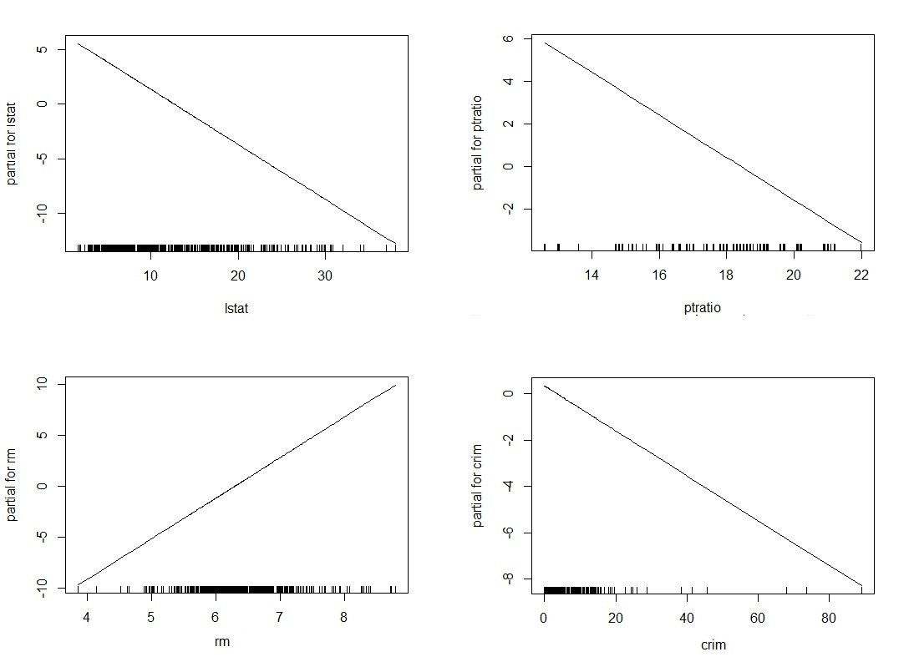
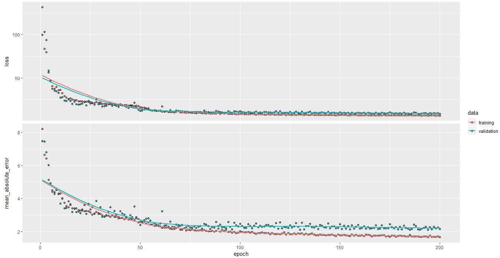

---

*2019*$\hspace{40em}$*Alumna: Maite Angel*

```{r,echo=FALSE,warning=FALSE,comment="",error=FALSE,message=FALSE}

library(shiny)
shinyUI(fluidPage(
  title="hola1",
  h2("Ciencia De datos",style="font-family:Brush Script Std, cursive;
     color:brown;
     font-size:40px;text-align: center;"),
  h3("Trabajo Practico",style="font-family:Brush Script Std, cursive;
     color:purple;
     font-size:32px;text-align: center;")
))
```


```{r,echo=FALSE,warning=FALSE,comment="",error=FALSE,message=FALSE}

library(shiny)
shinyUI(fluidPage(
  title="hola1",
  h2("Presentacion de los datos",style="font-family:Brush Script Std, cursive;
     color:brown;
     font-size:25px;")
))
```

En este trabajo vamos a usar el dataset __Boston Housing__ que trata sobre los factores que inciden en el valor de las casas de los suburbios de Boston.
Para ello tenemos 506 observaciones y de cada una de ellas tenemos su valor medio en miles de dolares (lo que buscamos predecir) y 13 otras variables que podrian incidir en este precio, ellas son: $crim$ tasa criminalidad; $zn$ proporcion de tierra residencial; $indus$ proporcion de negocios no minoristas por ciudad; $chas$ si limita o no con el rio Charles; $nox$ concentracion de oxidos de nitrogeno; $rm$ numero de habitaciones; $age$ Proporcion de unidades ocupadas antes de 1940; $dis$ media ponderada de distancias a cinco centros de empleo de boston; $rad$ accecibilidad a autopistas; $tax$ tasa de impuesto; $ptratio$ Proporcion alumnos por profesor; $black$ proporcion de poblacion negra; $lstat$ porcentaje de pobreza; $medv$ Valor medio de las viviendas ocupadas.

En primer lugar ganemos intuicion en lo que buscamos predecir;para ello hagamos un boxplot de los valores de las propiedades:


Veamos primero un grafico de los datos para darnos una idea de como son:

```{r,echo=FALSE,warning=FALSE,comment="",error=FALSE,message=FALSE}
#load("C:/Users/Maite/Downloads/BostonHousing.rda")
load("BostonHousing.rda")

attach(BostonHousing)
boxplot(BostonHousing$medv,col = "orangered2")
#skyblue1
```

Podemos ver que la mayoria de la propiedades se encuentran entre los USD 17000
y USD 25000.Aunque tambien hay presencia de outliers con un alto valor de propiedad.
Se alcanza una media de USD 22530 y una mediana de USD 21200.

En cuanto a la distribucion..

```{r,echo=FALSE,warning=FALSE,comment="",error=FALSE,message=FALSE}

ui <- fluidPage(

  # App title ----
  titlePanel("Histogram MEDV"),

  # Sidebar layout with input and output definitions ----
  sidebarLayout(

    # Sidebar panel for inputs ----
    sidebarPanel(

      # Input: Slider for the number of bins ----
      sliderInput(inputId = "bins",
                  label = "Number of bins:",
                  min = 1,
                  max = 50,
                  value = 30)

    ),

    # Main panel for displaying outputs ----
    mainPanel(

      # Output: Histogram ----
      plotOutput(outputId = "distPlot")

    )
  )
)

server <- function(input, output) {

  output$distPlot <- renderPlot({

    bins <- seq(min(medv), max(medv), length.out = input$bins + 1)
    hist(medv,freq = FALSE,breaks = bins)
    lines(density(medv),col="red",lwd=2)
    })

}

shinyApp(ui = ui, server = server)


```


Podemos concluir,sobre todo al aumentar el numero de bins en el histograma, que pareceria ser normal con algunos outliers al final.

Ahora si conozcamos un poco nuestras variables predictoras, para eso veamos un heatmap de la relacion entre ellas:


```{r,echo=FALSE,warning=FALSE,comment="",error=FALSE,message=FALSE}
library(reshape2)
library(ggplot2)


get_upper_tri <- function(cormat){
  cormat[lower.tri(cormat)]<- NA
  return(cormat)
}
reorder_cormat <- function(cormat){
  # Use correlation between variables as distance
  dd <- as.dist((1-cormat)/2)
  hc <- hclust(dd)
  cormat <-cormat[hc$order, hc$order]
}

library(reshape2)
library(ggplot2)
library(reshape2)
library(ggplot2)


mydata <- cbind(as.numeric(crim),as.numeric(zn),as.numeric(indus),as.numeric(chas),as.numeric(nox),as.numeric(rm),as.numeric(age),as.numeric(dis),as.numeric(rad),as.numeric(tax),as.numeric(ptratio),as.numeric(b),as.numeric(lstat),as.numeric(medv))
colnames(mydata)<-colnames(BostonHousing)[c(1:14)]
cormat <- round(cor(mydata),2)
cormat <- reorder_cormat(cormat)
upper_tri <- get_upper_tri(cormat)
# Melt the correlation matrix
melted_cormat <- melt(upper_tri, na.rm = TRUE)
# Create a ggheatmap
ggheatmap <- ggplot(melted_cormat, aes(Var2, Var1, fill = value))+
  geom_tile(color = "white")
ggheatmap + 
  geom_text(aes(Var2, Var1, label = value), color = "black", size = 4) +
  theme(
    axis.title.x = element_blank(),
    axis.title.y = element_blank(),
    panel.grid.major = element_blank(),
    panel.border = element_blank(),
    panel.background = element_blank(),
    axis.ticks = element_blank(),
    legend.justification = c(5.7, 1),
    legend.position = c(0.5,0.8),
    legend.direction = "vertical")+
  guides(fill = guide_colorbar(barwidth = 0.5, barheight = 11,
                               title.position = "top", title.hjust = 0.5))


```

Por supuesto tenes un 1 en la diagonal al ser enfrentadas las mismas variables, podemos observar que por ejemplo hay cierta correlacion de las variable $tax$ (tasa de impuesto) con   $rad$ (el acceso a autopistas) y $indus$(proporcion en acres de negocios no minoristas). 
Mientras que por ejemplo la variable $chas$ (si la propiedad delimita con un rio o no) parece no estar relacionada con ninguna.


Ahora prestemosle mas atencion a las que parecerian tener mayor correlacion con la variable a predecir $medv$ veamos algunos graficos para ver cuales podrian ser algunos candidatos para ser variables relevantes a la hora de predecir:

```{r,echo=FALSE,warning=FALSE,comment="",error=FALSE,message=FALSE}
library(GGally)
ggpairs(as.data.frame(cbind(medv,ptratio,tax,nox,rm,indus,lstat)))
```

Las variables relevantes para nuestro problema de prediccion parecerian ser $lstat$ con un -0.73 de correlacion con $medv$ y $rm$ con 0.69. Observemos que $lstat$
 tiene signo negativo lo que significa que cuanto mas alto sea este indice menor sera el valor de $medv$ y con $rm$ lo contrario, a medida que sea mayor subira el precio medio de las propiedades.

Veamos la relacion de estas ultimas mas de cerca..

```{r,echo=FALSE,warning=FALSE,comment="",error=FALSE,message=FALSE}
library(rgl)
library(glmnet)

n<-100
VarLstat<- lstat
VarRm <- rm
y <- medv

ui <- fluidPage(
  hr(" "),

  rglwidgetOutput("plot",  width = 800, height = 600)
)

server <- (function(input, output) {

  output$plot <- renderRglwidget({
    #rgl.open()
    plot3d(VarLstat,VarRm,y,col = "black")
    #plot3d(x1,x2,y,col = rainbow(1000))
    rglwidget()
  })
})   

shinyApp(ui = ui, server = server)

```


```{r,echo=FALSE,warning=FALSE,comment="",error=FALSE,message=FALSE}

library(shiny)
shinyUI(fluidPage(
  title="hola1",
  h2("Metodos",style="font-family:Brush Script Std, cursive;
     color:brown;
     font-size:25px;")
))
```

Con el fin de al final de este trabajo comparar los metodos predictivos utilizados vamos a usar el 90%, dejando el restante 10% para validacion.

```{r,echo=FALSE,warning=FALSE,comment="",error=FALSE,message=FALSE}
load("BostonHousing.rda")

library(robust)
library(rgl)
library(glmnet)
library(HoRM)
library(NeuralNetTools)
library(nnet)
library(gam)
library(GGally)
library(caret)

set.seed(215)
Entrenamiento<-sample(c(1:506),456,replace=FALSE)
NValidacion<-setdiff(c(1:506),Entrenamiento)

Validacion<-BostonHousing[NValidacion,]
EBostonHousing<-BostonHousing[Entrenamiento,]
attach(EBostonHousing)

```


```{r,echo=FALSE,warning=FALSE,comment="",error=FALSE,message=FALSE}

library(shiny)
shinyUI(fluidPage(
  title="hola1",
  h2("Regresion Lineal Clasica",style="font-family:Brush Script Std, cursive;
     color:blue;
     font-size:25px;")
))
```

Comencemos con regresion lineal para este utilizaremos el comando $lm$.
Observemos los siguientes graficos:
```{r,echo=FALSE,warning=FALSE,comment="",error=FALSE,message=FALSE}
#Regresion Lineal Clásica
RegLineal<-lm(medv~.,data=EBostonHousing)
ErrorRegLineal<-mean((Validacion[,14]-predict(RegLineal,as.data.frame(Validacion[,c(1:13)])))^2)
```


Hablemos un poco de la heterocedasticidad.Los residuos parecen significativamente mayores en los extremos. Hurgando un poco en los datos vemos que el 20% de los datos observados supera el 5 de residuos donde la gran mayoria de ellos se encuentre en los valores menores a 12 y mayores a 30.
Por lo cual podriamos estar en un caso de heterocedasticidad y la regresion lineal no seria tan adecuada.

Pero aun puede seguir veamos cuales variables tiene el menor p-valor usemos $varimp $ de caret para cuantificar esta relacion:
```{r,echo=FALSE,warning=FALSE,comment="",error=FALSE,message=FALSE}
varImp(RegLineal)
```

Las variables mas significativas son: $lstat$, $rm$, $ptratio$ y $dis$. Lo que parece coincidir con lo que venimos viendo en nuestros datos 

Por ultimo confeccionemos un grafico clasico que podamos verlo en todos nuestros metodos los datos reales de validacion con los predichos

```{r,echo=FALSE,warning=FALSE,comment="",error=FALSE,message=FALSE}
datos<-Validacion[,14]
Prediccion<-predict(RegLineal,as.data.frame(Validacion[,c(1:13)]))
plot(datos,Prediccion,col="red",ylim=c(0,50),xlim=c(0,50),pch=16)
lines(x = c(0,50), y = c(0,50))
```

El error de validacion obtenido en la regresion lineal clasica es de 24.07.


```{r,echo=FALSE,warning=FALSE,comment="",error=FALSE,message=FALSE}

library(shiny)
shinyUI(fluidPage(
  title="hola1",
  h2("Regresion Lineal Robusta",style="font-family:Brush Script Std, cursive;
     color:blue;
     font-size:25px;")
))
```

Ahora veamos de vuelta regresion lineal pero calculando los coeficientes de manera robusta, usaremos el comando $lmrob$.

```{r,echo=FALSE,warning=FALSE,comment="",error=FALSE,message=FALSE,results='hide'}
#Regresion Lineal Robusta
RegLinealRob<-lmRob(medv~.,data=EBostonHousing)
ErrorRegLinealRob<-mean((Validacion[,14]-predict(RegLinealRob,as.data.frame(Validacion[,c(1:13)])))^2)

```


Nuevamente vemos un comportamientos distinto para los valores extremos de las propiedades.Aca se ven un poco mas acentuados para las propiedades de mayor valor.

Veamos que contraste encontramos ahora a la hora de ver la variables relevantes en comparacion a la regresion lineal clasica, para ello haremos un $summary$ y observaremos las variables que tengan menor p-valor.
```{r,echo=FALSE,warning=FALSE,comment="",error=FALSE,message=FALSE}
#varImp(RegLinealRob) no funciona
#summary(RegLinealRob)
```

Las variables mas significativas son: $dis$, $rm$, $ptratio$ y $black$.Se mantienen casi las mismas excepto $lstat$ y aparece $black$.

Por ultimo confeccionemos el grafico clasico de los datos reales de validacion con los predichos:

```{r,echo=FALSE,warning=FALSE,comment="",error=FALSE,message=FALSE}
datos<-Validacion[,14]
Prediccion<-predict(RegLinealRob,as.data.frame(Validacion[,c(1:13)]))
plot(datos,Prediccion,col="red",ylim=c(0,50),xlim=c(0,50),pch=16)
lines(x = c(0,50), y = c(0,50))
```

Aca vemos que los datos centrales parecerian pegarse mejor a la identidad sin embargo los extremos estan mas equivocados que en la regresion clasica y eso arruina el error.


El error de validacion obtenido en la regresion lineal robusta es de 33.54.


```{r,echo=FALSE,warning=FALSE,comment="",error=FALSE,message=FALSE}

library(shiny)
shinyUI(fluidPage(
  title="hola1",
  h2("Regresion Ridge",style="font-family:Brush Script Std, cursive;
     color:blue;
     font-size:25px;")
))
```

Ahora que pasa si penalizamos los coeficientes? 
Probemos regularizando la forma de ajustar el modelo a traves de una regresion Ridge, usaremos el comando $glmnet$.Elegiremos el lambda adecuado a traves de Cross Validation en la muestra de entrenamiento.
Se estandarizaran los datos.

```{r,echo=FALSE,warning=FALSE,comment="",error=FALSE,message=FALSE,results='hide'}
#Regresion Ridge
set.seed(215215)
y<-as.numeric(EBostonHousing[,14])

mat<-c()
for (i in c(1:13)){
  mat<-cbind(mat,scale(as.numeric(EBostonHousing[,i])))
  #((as.numeric(EBostonHousing[,i])-mean((as.numeric(EBostonHousing[,i]))))/var((as.numeric(EBostonHousing[,i])))))

}

lambda_vals <-rev(seq(0,100, by = 0.01))
ridge<-glmnet(mat,y,alpha=0,lambda=lambda_vals)

#plot(ridge,xvar="lambda",label=TRUE)
#abline(1,0,lwd=3,col=3,lty=3)
secu<-seq(from=0,to=2,length.out=1000)
cvRidge<-cv.glmnet(mat,y,alpha=0,nfolds=10,lambda=secu)
#plot(cvRidge)

lambdaGanadorR<-cvRidge$lambda.min
ajus.Ridge.ganador<-glmnet(mat,y,alpha=0,lambda=lambdaGanadorR)

y2<-as.numeric(Validacion[,14])
mat2<-c()
for (i in c(1:13)){
  mat2<-cbind(mat2,scale(as.numeric(Validacion[,i])))
}
ErrorRidge<-mean(abs(Validacion[,14]-predict.glmnet(ajus.Ridge.ganador,newx=mat2))^2)


plot(ridge,xvar="lambda",label=TRUE)
abline(1,0,lwd=3,col=3,lty=3)
secu<-seq(from=0,to=2,length.out=1000)
cvRidge<-cv.glmnet(mat,y,alpha=0,nfolds=10,lambda=secu)
plot(cvRidge)
```

En el primer grafico vemos efectivamente como los coeficientes van convergiendo a cero cuando aumenta el lambda.
Y en el segundo vemos tambien que al crecer lambda el error de minimos cuadrados se dispara por lo cual nos mantendremos en valores "bajos" de lambda.


Veamos ahora nuestro plot de validacion vs prediccion para distintos valores de lambda

```{r,echo=FALSE,warning=FALSE,comment="",error=FALSE,message=FALSE}
library(ggplot2)
ui <- fluidPage(

 # Sidebar layout with a input and output definitions
 sidebarLayout(
 # Inputs: Select variables to plot
 sidebarPanel(
 # Select variable for y-axis
 # Select variable for x-axis
  numericInput('x', 'Lambda elegido', 0.2, min = 0.001, max = 20)
  ),
 # Output: Show scatterplot
 mainPanel(
 plotOutput(outputId = "scatterplot")
 )
 )
)
 # Define server function
server <- function(input, output) {

 # Create the scatterplot object the plotOutput function is expecting
 output$scatterplot <- renderPlot({
   
  y<-as.numeric(EBostonHousing[,14])
  mat<-c()
  for (i in c(1:13)){
    mat<-cbind(mat,scale(as.numeric(EBostonHousing[,i])))
    #((as.numeric(EBostonHousing[,i])-mean((as.numeric(EBostonHousing[,i]))))/var((as  .numeric(EBostonHousing[,i])))))
  }
  
   ajus.Ridge.ganador<-glmnet(mat,y,alpha=0,lambda=input$x)
   DatosValidacion<-as.numeric(Validacion[,14])
  mat2<-c()
  for (i in c(1:13)){
    mat2<-cbind(mat2,scale(as.numeric(Validacion[,i])))
  }
  prediccion<-predict.glmnet(ajus.Ridge.ganador,newx=mat2)
   
 ggplot(data = as.data.frame(cbind(DatosValidacion,prediccion)), aes(DatosValidacion, prediccion)) +
 geom_point(color='red', size = 3)+
 geom_abline(intercept = 0)+
 xlim(0, 50)+
 ylim(0, 50)
 })
 
}

shinyApp(ui = ui, server = server)
  
```

 Nota: En este grafico, el usuario puede ingresar cualquier valor de lambda, se computara ridge y se vere la prediccion.

Para valores chicos de lambda no se hace muy visible la diferencia entre los metodos como vimos en los anteriores graficos los errores son muy similares. En cambio para valores grandes de lambda la prediccion se aleja bruscamente de ser buena y es casi constante(se recomienda contrastar los lambdas 0.1 y 80).


El Lambda ganador, i.e. el que alcanza el menor error, es el 0.18 con un error de validacion de 26.41.


Nota: Curiosamente el error aumenta en comparacion a la regresion lineal, esto indica que nuestras variables no estaban tan correlacionadas y no eras quizas necesario regulizar ya que al hacerlo estamos sesgando un poco la prediccion.


```{r,echo=FALSE,warning=FALSE,comment="",error=FALSE,message=FALSE}

library(shiny)
shinyUI(fluidPage(
  title="hola1",
  h2("Regresion LASSO",style="font-family:Brush Script Std, cursive;
     color:blue;
     font-size:25px;")
))
```

Podemos tambien regularizar a traves de LASSO, usaremos nuevamente el comando $glmnet$.Elegiremos el lambda adecuado a traves de Cross Validation en la muestra de entrenamiento.
Se estandarizaran los datos.

```{r,echo=FALSE,warning=FALSE,comment="",error=FALSE,message=FALSE,results='hide'}

#LASSO
y<-as.numeric(EBostonHousing[,14])

mat<-c()
for (i in c(1:13)){
  mat<-cbind(mat,scale(as.numeric(EBostonHousing[,i])))
}

lambda_vals <-rev(seq(0, 100, by = 0.01))
LASSO<-glmnet(mat,y,alpha=1,lambda=lambda_vals)
#plot(cv.LASSO)


secu<-seq(from=0,to=2,length.out=1000)
cv0<-cv.glmnet(mat,y,alpha=1,nfolds=10,lambda=secu)
#plot(cv0)
lmin<-cv0$lambda.min
ajus.LASSO.ganador<-glmnet(mat,y,alpha=1,lambda=lmin)

y2<-as.numeric(Validacion[,14])
mat2<-c()
for (i in c(1:13)){
  mat2<-cbind(mat2,scale(as.numeric(Validacion[,i])))
}

ErrorLASSO<-mean((Validacion[,14]-predict(ajus.LASSO.ganador,newx=mat2))^2)


plot(LASSO,xvar="lambda",label=TRUE)
abline(1,0,lwd=3,col=3,lty=3)
secu<-seq(from=0,to=2,length.out=1000)
plot(cv0)

```

El error de validacion obtenido en la regresion LASSO es de 26.34 con un Lambda ganador de 0.05 veamos nuevamente como cambia la prediccion en funcion del lambda elegido:

```{r,echo=FALSE,warning=FALSE,comment="",error=FALSE,message=FALSE}
library(ggplot2)
ui <- fluidPage(

 # Sidebar layout with a input and output definitions
 sidebarLayout(
 # Inputs: Select variables to plot
 sidebarPanel(
 # Select variable for y-axis
 # Select variable for x-axis
  numericInput('x', 'Lambda elegido', 0.2, min = 0.001, max = 20)
  ),
 # Output: Show scatterplot
 mainPanel(
 plotOutput(outputId = "scatterplot")
 )
 )
)
 # Define server function
server <- function(input, output) {

 # Create the scatterplot object the plotOutput function is expecting
 output$scatterplot <- renderPlot({
   
  y<-as.numeric(EBostonHousing[,14])
  mat<-c()
  for (i in c(1:13)){
    mat<-cbind(mat,scale(as.numeric(EBostonHousing[,i])))
    #((as.numeric(EBostonHousing[,i])-mean((as.numeric(EBostonHousing[,i]))))/var((as  .numeric(EBostonHousing[,i])))))
  }
  
   ajus.ganador<-glmnet(mat,y,alpha=1,lambda=input$x)
   DatosValidacion<-as.numeric(Validacion[,14])
  mat2<-c()
  for (i in c(1:13)){
    mat2<-cbind(mat2,scale(as.numeric(Validacion[,i])))
  }
  prediccion<-predict.glmnet(ajus.ganador,newx=mat2)
   
 ggplot(data = as.data.frame(cbind(DatosValidacion,prediccion)), aes(DatosValidacion, prediccion)) +
 geom_point(color='red', size = 3)+
 geom_abline(intercept = 0)+
 xlim(0, 50)+
 ylim(0, 50)
 })
 
}

shinyApp(ui = ui, server = server)
  
```


Ahora si prestamos atencion a los coeficientes que le otorga Lasso a cada variable, este modelo se convierte en un selector natural de variables, ya que las que no sean signficativas tendran coef igual a 0. Usaremos lambda 0.38,que es el mayor lambda tal que su error esta alejado en menos de 1 que el del minimo para tener mas idea de quienes son las variables que importan, ya que con nuestro lamda de 0.05 todavia sobreviven en el modelo 11 variables.
Como se puede ver en el grafico de arriba con lambdas 0.05 y 0.38 la prediccion no se ve casi alterada.

Veamos los coeficientes producidos por Lasso, obtenemos lo siguiente:
```{r,echo=FALSE,warning=FALSE,comment="",error=FALSE,message=FALSE}
#coef(ajus.LASSO.ganador)
h<-coef(glmnet(mat,y,alpha=1,lambda=cv0$lambda.1se))
k<-c("intercept","crim", "zn", "indus", "chas","nox", "rm", "age", "dis","rad", "tax","ptratio", "black","lstat")
row.names(h)<-k
h

```

Observemos que $lstat$ (porcentaje de pobreza),$ptratio$(proporcion alumno profesor)  y $rm$ (numero de habitaciones) parecen los valores significativos en el valor de una propiedad. 
Mientras que $zn$,$indus$,$age$,$rad$ y $tax$ parecerian no ser relevantes a la hora de predecir.


```{r,echo=FALSE,warning=FALSE,comment="",error=FALSE,message=FALSE}

library(shiny)
shinyUI(fluidPage(
  title="hola1",
  h2("Regresion GAM",style="font-family:Brush Script Std, cursive;
     color:blue;
     font-size:25px;")
))
```

Probemos ahora ajustar con un modelo aditivo generalizado y tiremos por la borda la idea de asumir linealidad entre los parametros. Para esto usaremos la funcion $gam$.
```{r,echo=FALSE,warning=FALSE,comment="",error=FALSE,message=FALSE,results='hide'}

#Regresion GAM
ajus.gam <- gam(medv~.,data=EBostonHousing)
#summary(ajus.gam)
#par(mfrow=c(2,2))
#par(mar=c(rep(4,4)))
#plot(ajus.gam,se=T)
#par(mfrow=c(1,1))
#coefficients(ajus.gam)

ErrorGAM<-mean((Validacion[,14]-predict(ajus.gam,as.data.frame(Validacion[,c(1:13)])))^2 )

```

Viendo un poco la infomacion que nos da el $summary$ podemos identificar que variables resultaron relevantes en el proceso, algunas de ellas son $lstat$,$rm$,$pratio$ y $crim$.Veamos algunos graficos de ellas en funcion del valor de las propiedades.




Podemos ver como en $lstat$ a medida que el porcentaje de pobreza crece, las propiedades caen ; en $rm$ a medida que aumenta el numero de habitaciones, aumenta el valor de la propiedad: en $crim$ es logico que a mas crimen en el area las propiedades valgan menos;en $pratio$ tambien se puede apreciar que cuantos mas alumnos por profesor (menos acceso a una educacion personalizada) decaen los precios.


El error de validacion obtenido en la regresion GAM es de 24.07 (*igual al de regresion lineal! ver nota al final*) y tenemos el siguiente grafico de prediccion:

```{r,echo=FALSE,warning=FALSE,comment="",error=FALSE,message=FALSE}
datos<-Validacion[,14]
Prediccion<-predict(ajus.gam,as.data.frame(Validacion[,c(1:13)]))
plot(datos,Prediccion,col="red",ylim=c(0,50),xlim=c(0,50),pch=16)
lines(x = c(0,50), y = c(0,50))
```


*Nota: La funcion GAM vuelve a Regresion Lineal! Los summary dan iguales! Miremos los coeficientes de ambas:*

*Coeficientes Regresion Lineal:*
```{r,echo=FALSE,warning=FALSE,comment="",error=FALSE,message=FALSE}
coef(RegLineal)
```
*Coeficientes Regresion GAM:*

```{r,echo=FALSE,warning=FALSE,comment="",error=FALSE,message=FALSE}
coef(ajus.gam)
```

*Son iguales, esto indica que en estos modelos aditivos, una combinacion lineal es lo mas efectivo a la hora de predecir*

```{r,echo=FALSE,warning=FALSE,comment="",error=FALSE,message=FALSE}

library(shiny)
shinyUI(fluidPage(
  title="hola1",
  h2("Regresion PPR",style="font-family:Brush Script Std, cursive;
     color:blue;
     font-size:25px;")
))
```

Metamosnos ahora un poco con IA, empecemos entonces por PPR que es si se quiere una version simplificada de una red neuronal.Utilizaremos el comando $PPR$. Probando con distintas cantidades de terminos, decidimos que es conveniente usar 4. Por lo que en este caso debemos calcular 4 funciones con sus respectivos pesos.

Asi quedan los graficos de las funciones Ridge que genero PPR:

```{r,echo=FALSE,warning=FALSE,comment="",error=FALSE,message=FALSE,results='hide'}
#Regresion PPR
set.seed(8215)
ajus.ppr <- ppr(medv~.,data=EBostonHousing, nterms = 4, max.terms = 4,trace=TRUE)
#summary(ajus.ppr)
par(mfrow=c(2,2))
plot(ajus.ppr,col="brown")
par(mfrow=c(1,1))

ErrorPPR<-mean((Validacion[,14]-predict(ajus.ppr,as.data.frame(Validacion[,c(1:13)])))^2)

```

Prestemosle atencion a los coeficientes y a como interrelacionan a la variables estas funciones:

Estos son los coeficientes para cada termino:
```{r,echo=FALSE,warning=FALSE,comment="",error=FALSE,message=FALSE}
ajus.ppr$beta
```
Y estos los pesos para cada variable:

```{r,echo=FALSE,warning=FALSE,comment="",error=FALSE,message=FALSE}
ajus.ppr$alpha
```


sumando los pesos por el coef. de cada termino tenemos que $rm$ y $lstat$ son variables relevantes y nos llama la atencion a una nueva varibles $nox$ que podria ser una nueva candidata.


El error de validacion obtenido por PPR es de 14.5, mucho menor de lo que venimos viendo, y el siguiente grafico de prediccion:


```{r,echo=FALSE,warning=FALSE,comment="",error=FALSE,message=FALSE}
datos<-Validacion[,14]
Prediccion<-predict(ajus.ppr,as.data.frame(Validacion[,c(1:13)]))
plot(datos,Prediccion,col="red",ylim=c(0,50),xlim=c(0,50),pch=16)
lines(x = c(0,50), y = c(0,50))
```


Mejoran notablemente los extremos y se pegan mucho mas a la identidad.


```{r,echo=FALSE,warning=FALSE,comment="",error=FALSE,message=FALSE}

library(shiny)
shinyUI(fluidPage(
  title="hola1",
  h2("Regresion ANN",style="font-family:Brush Script Std, cursive;
     color:blue;
     font-size:25px;")
))
```

Ahora si las esperadas redes neuronales, usaremos el comando $nnet$.

A la hora de plantear una red neuronal tenemos que elegir la cantidad de capas y la cantidad de filtros/neuronas que tendra. Despues de probar diversas combinaciones y calcular error una buena opcion parece ser una red con una sola capa y 6 neuronas;tendremos entonces 91 pesos que calcular.Tendra la siguiente pinta:


```{r,echo=FALSE,warning=FALSE,comment="",error=FALSE,message=FALSE,results='hide'}

set.seed(455)
#set.seed(21589)
ajus.nnet1 <- nnet(medv~.,data=EBostonHousing, size=5, decay=0.5, 
                  maxit=3000, linout=1, trace=TRUE)
plotnet(ajus.nnet1)
ErrorANN1<-mean((Validacion[,14]-predict(ajus.nnet1,as.data.frame(Validacion[,c(1:13)])))^2)
```


Ahora si, pongamosla a prueba. En el siguiente grafico vemos como al iterar la red aprende, se entrena, y el error cae:


El error final de validacion obtenido por ANN  es de 10.9 con el siguiente grafico de prediccion:

```{r,echo=FALSE,warning=FALSE,comment="",error=FALSE,message=FALSE}
datos<-Validacion[,14]
Prediccion<-predict(ajus.nnet1,as.data.frame(Validacion[,c(1:13)]))
plot(datos,Prediccion,col="red",ylim=c(0,50),xlim=c(0,50),pch=16)
lines(x = c(0,50), y = c(0,50))
```

veamos ahora con el comando $varimp$ de Caret si con este bajo error podemos reconocer cuales son las variables importantes:


$lstat$ y $rm$ siguen estando en nuestra lista a la que suma $nox$.


Vimos que disminuyo notoriamente el error, pongamosnos un poco mas ambiciosos y aumentemos el numero de neuronas y agreguemos algunas capas mas.
Vamos a hacer una red neuronal de 3 capas que tendran 13,6 y 5 filtros respectivamente; por lo tanto tendremos que calcular 307  parametros.Tendra la siguiente pinta:


Usemos el paquete de R $Keras$ con $tensorflow$ para calcularlos
Obtenemos los siguientes resultados:



El error final de validacion obtenido por ANN de 3 capas disminuye a 9.8 y tiene el siguiente grafico de prediccion:

```{r,echo=FALSE,warning=FALSE,comment="",error=FALSE,message=FALSE}
datos<-Validacion[,14]
Prediccion<-c( 19.20237,17.94830 ,20.91465,14.73048,23.89718, 32.91615, 18.93529, 22.10518, 19.78904, 22.09327, 22.84218, 26.01192, 18.91021, 27.58356, 38.66227,40.33010, 29.57443, 29.1707, 45.72510, 23.29786, 15.98208, 24.49099, 41.78743, 26.20502, 22.38934 ,32.77359 ,24.95976, 33.34144 ,32.92231, 30.38753, 19.50075, 18.74609, 21.00220, 20.42916, 29.21568, 27.28694, 12.07465, 12.29670, 14.01283,12.08380,12.05417,19.13687,12.05164,12.13780,12.05193,12.04807,12.09782,14.71102,26.81826,20.04958)
plot(datos,Prediccion,col="red",ylim=c(0,50),xlim=c(0,50),pch=16)
lines(x = c(0,50), y = c(0,50))
```


```{r,echo=FALSE,warning=FALSE,comment="",error=FALSE,message=FALSE}

library(shiny)
shinyUI(fluidPage(
  title="hola1",
  h2("Modelo ganador",style="font-family:Brush Script Std, cursive;
     color:brown;
     font-size:25px;")
))
```


Recopilemos un poco la performance de nuestros modelos.
A la hora de calcular el error de validacion se uso la siguiente funcion de perdida:
$$\frac{\sum_{i}( y_{i} - \hat{y_{i}})^{2}}{n}$$
donde $y_{i}$ es cada observacion del conjunto de validacion y $\hat{y_{i}}$ su prediccion.

Obtuvimos en resumen los siguientes resultados:


```{r,echo=FALSE,warning=FALSE,comment="",error=FALSE,message=FALSE}
h2<-rbind(ErrorRegLineal,ErrorRegLinealRob,ErrorRidge,ErrorLASSO,ErrorGAM,ErrorPPR,10.90767,9.87602)
rownames(h2)<-c("Reg Lineal","Reg Lineal Rob","Ridge","LASSO","GAM","PPR","ANN 1 capa","ANN 3 capas")
colnames(h2)<-c("Errores")
h2

```


Luego elegimos como ganador a la red neuronal de 3 capas aunque cabe destacar que en algunas corridas PPR tenia una mejor performance que ambas redes neuronales.


```{r,echo=FALSE,warning=FALSE,comment="",error=FALSE,message=FALSE}

library(shiny)
shinyUI(fluidPage(
  title="hola1",
  h2("Conclusion de Variables significativas",style="font-family:Brush Script Std, cursive;
     color:brown;
     font-size:25px;")
))
```


Luego de todo este estudio, con todos estos resultados concluimos que $lstat$, $rm$ y $nox$ es un buen conjunto de variables significativas a la hora de predecir los valores de las propiedades. 


